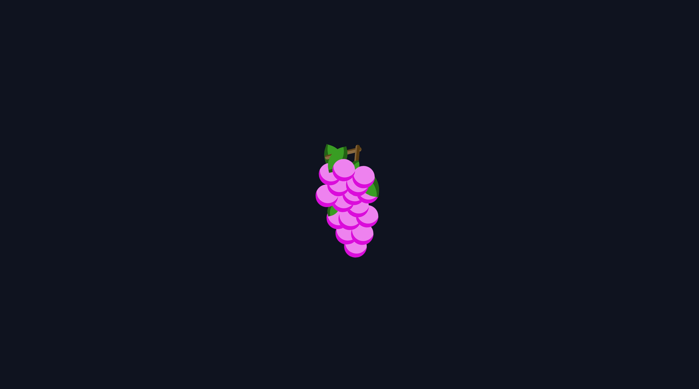

# GrapeCSS

> **This personal web project was created to experiment and test CSS.**

## Description

- GrapeCSS is a simple HTML and CSS illustration of a bunch of grapes.
- This project has no professional objective.

## Technologies used

- HTML5
- CSS3

## Author

[TolMen](https://github.com/TolMen) - [LinkedIn](https://www.linkedin.com/in/jessyfrachisse/)

## License

This project is licensed under MIT - View file [license](LICENSE) for more details.
